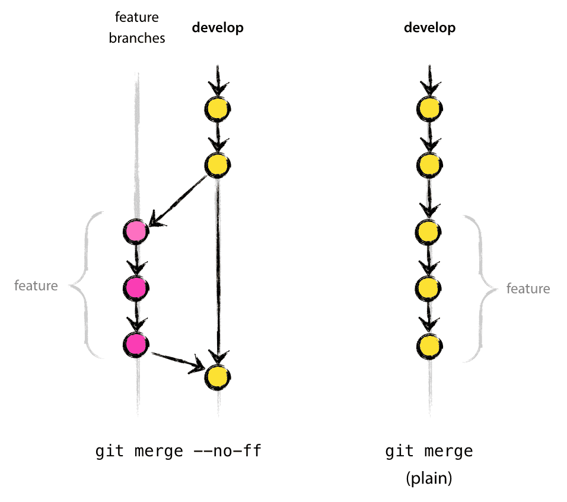

### Git Rebase:
- **Princip:** Přesune kompletní vývojovou větev (branch) na jiný bod historie, čímž vypadá, že všechny změny byly vytvořeny za sebou.
- **Výhody:**
    1. **Čistší historie:** Rebase může vytvořit lineární historii, což usnadňuje porozumění historii vývoje projektu.
    2. **Méně zbytečných commitů:** Rebase umožňuje spojení (squash) commitů, které nejsou důležité pro finální historii.
    3. **Zabránění konfliktů:** Konflikty jsou řešeny v reálném čase, když se provádí rebase, což umožňuje jednodušší řešení.
- **Kdy použít:** použijte, když chcete udržet historii repozitáře čistou a lineární, například při práci na vlastních feature branchích.

### Git Merge --no-ff:
- **Princip:** Vytvoří nový commit, který sloučí změny z jiné větve do cílové větve.
- **Výhody:**
    1. **Bezpečnostní záznamy:** Každý merge vytvoří nový záznam o spojení v historii repozitáře.
    2. **Viditelnost vývoje větví:** Merge zachovává historii každé větve, což usnadňuje sledování, kde se větve spojují a odchylují.
    3. **Jednodušší zpětné sledování změn:** Každý merge commit obsahuje informace o tom, které změny byly sloučeny a z které větve.
- **Kdy použít:** pokud chcete zachovat jasnou historii větví a jasně viditelné body spojení mezi nimi, nebo pokud spolupracujete na sdílené větvi a chcete zachovat detailní informace o změnách.

### Git rebase -i & git push -f
- Slouží k **přepisování historie** - řazení/dělení/slušování commitů
- **!! Není dobré přepisovat historii sdílených větví !!**
- Vhodné pro přehlednějsí pull/merge requesty, např.:
  1. setřídění importů před samotnou editací komponenty, následně pak úpravy přidání/odebrání
  2. přídání generovaného modelu, následně jeho použití

### Užitečná nastavení/příkazy
- `git config --global --list`
- `git config --global pull.rebase true` - remote má pravdu a lokální změny/commity patří až na konec
- `git config --global push.autoSetupRemote true` - pokud neexistuje remote tracking branch, tak se pri git push automaticky založí 

### Zdroje
- https://nvie.com/posts/a-successful-git-branching-model/ 
